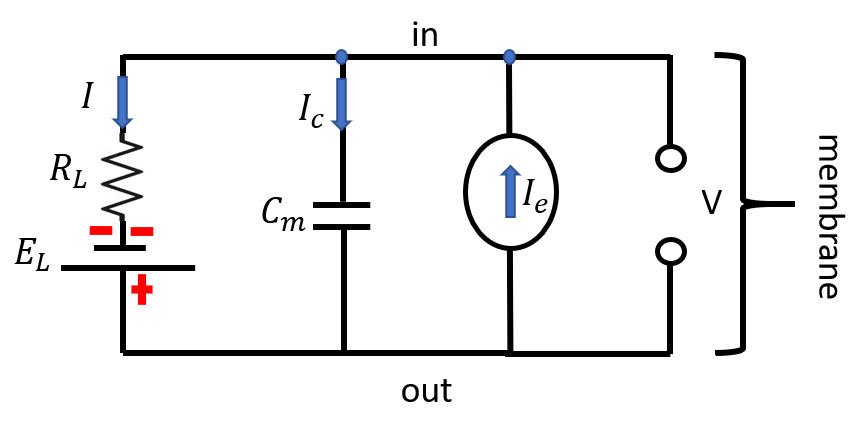

## integrate and fire model (lecture 4, 5)

The equivalent circuit model of a neuron that was built in lecture is essentially a simple RC circuit with the addition of a *battery* to *capture the non-zero membrane resting potential*. The lipids on the cell membrane provides electrical insulation between the intracellular fluid and the extracellular fluid. This creates a capacitor, with capacitance proportional to the cell's surface area (A). The cell membrane is not a perfect insulator. Pores in the membrane allow ions to move across it. A cell's total membrane conductance ($G_m$) represents how easily ions flow across the membrane.

The simplest circuit that models a neuron with a leak is described by the following differential equation:
$$\tau_m \frac{dV(t)}{dt} = - (V(t) - E_L) + R_L I_e \tag{1.1}$$

To solve $(1)$, remember we have derived from the previous RC model of a neuron that
$$V + \tau \frac{dV}{dt} = V_{\infty} \tag{0.1}$$
has the following solution
$$V(t) = V_{\infty} + (V_0 - V_{\infty}) e^{-t/\tau} \tag{0.2}$$
where $V_{\infty}$ is the steady-state solution of $V(t)$ when $\frac{dV}{dt} = 0$.

Back to $(1)$. We start with finding $V_{\infty}$ by setting $\frac{dV}{dt} = 0$ and get
$$V_{\infty} = E_L + R_L I_e \tag{1.2}$$
Importantly, in this basic version of the LIF model, we reset $V(t)$ to $V_{reset}$ after the spike, and we'd also have $V(t=0) = V_{reset}$.

This then brings to our final solution for $(1.1)$:
$$V(t) = E_L + R_L I_e + (V_{reset} - R_L I_e - E_L) e^{-t/\tau_m} \tag{1.3}$$

### firing rates in the LIF model (Lapicque 1907)

The membrane's voltage threshold at which an action potential is triggered was measured to be $-50 mV$. In Lapicque's integrate and fire model, a neuron's membrane potential $V$ is simply reset to $V_{reset}$ when $V$ reaches $V_{threshold}$. In the absence of electrode current, the membrane voltage $V$ relaxes to the potential $E_L$, the resting potential of the cell.

#### firing rate

The time between the two consecutive resets is considered the interspike-interval $T_{isi}$. The firing rate $f$ is its inverse:

$$f = \frac{1}{T_{isi}}$$

This definition of firing rate ignores the refractory period of the neuron.

To calculate $f$, we find $T_{isi}$ from the solution by setting $V_{th} = V(T_{isi})$,

$$V_{threshold} =  E_L + R_L I_e +(V_{reset} - E_L -R_L I_e)\exp \bigg(-\frac{T_{isi}}{\tau_m} \, \bigg)$$

Solving for $T_{isi}$ by rearranging the equation

$$ \frac{V_{th} - (E_L + R_L I_e)}{ V_{reset} - E_L - R_L I_e } = \exp(-T_{isi}/\tau_m)$$

Taking the logarithm of both sides, we find

$$f = \frac{1}{\tau_m} \ \frac{1}{\ln \left( \frac{E_L + R_L I_e - V_{reset}}{E_L + R_L I_e - V_{th}} \right)}$$

#### firing rate vs. injected current

$$Q = C_m V \to I_e = C_m \frac{dV}{dt}$$

Let $\Delta t = C_m \Delta V / I_e$

$$f = \frac{1}{\Delta t} = \frac{I_e}{C_m \Delta V} = \frac{I_e}{C_m (V_{threshold} - V_{reset})}$$

Therefore, the firing rate varies linearly with the injected current.

#### refractory period

In reality, it takes time for the ion pumps of a neuron to bring it back to the equilibrium state after a spike due to hyperpolarization. The time period immediately after the spike when the neuron is unable to spike again is called the **refractory period**.

Let $t_{ref}$ be our refractory period. We modify our firing rate by adding this additional term to $\Delta t$:

$$ f = \frac{1}{\Delta T + t_{ref}} = \frac{I_e}{C_m(V_{th} - V_{reset}) + I_e t_{ref}}$$

### extensions of the LIF model

The extended LIF model is more realistic than the above RC model + $V_{reset}$. Instead of resetting the voltage each time it reaches $V_{threshold}$, we will increase the conductance of potassium out of the cell right. Though, take note that in this extended model, we are only adding the potassium ion channel. The model now has two equations:

$$C_m \frac{dV}{dt} = -G_L (V - E_L) - G_K(t) (V - E_K) + I_e \tag{2.1}$$
$$\tau_r \frac{dG_K}{dt} = -G_K, \ \ G_K \to G_K + \Delta G_K \tag{2.2}$$

First, we will solve for $V_{\infty}$ by setting $$\frac{dV}{dt} = 0 \tag{2.3}$$

$$V_{\infty} = \frac{I_e + G_L E_L + G_K(t) E_K}{G_L + G_K(t)}$$
Next, we solve $(2.2)$ for $G_K(t)$:
$$\int \frac{dG_K}{G_K(t)} = \int \frac{-1}{\tau_r} dt$$
$$\ln G_K(t) = -t/\tau_r + C$$
$$G_K(t) = G_K(0) e^{-t/\tau_r}$$
In order to arrange to $(0.2)$ so that we know how to write our final solution, we still need to solve for $\tau$ in $(0.1)$, which we will call $\tau_{eff}$. To do that, we will need to rearrange $(2.1)$ to the form of $(0.1)$ (then we can just read $\tau_{eff}$ off our new equation!)

After some algebra, we will find
$$\tau_{eff} = \frac{C_m}{G_K(t) - G_L}$$
Now, we can write the final solution for $(2.1) \text{ and } (2.2)$:
$$V(t) = \frac{I_e + G_L E_L + G_K(t) E_K}{G_L + G_K(t)} + \left(V_{reset} -  \frac{I_e + G_L E_L + G_K(t) E_K}{G_L + G_K(t)} \right) e^{-t/\tau_{eff}}$$
where $$G_K(t) = G_K(0) e^{-t/\tau_r}$$