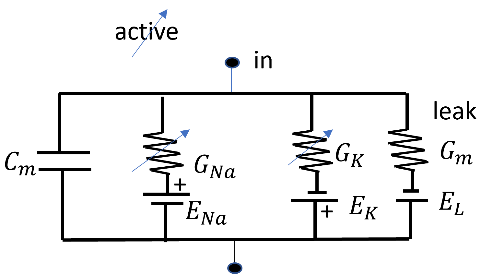
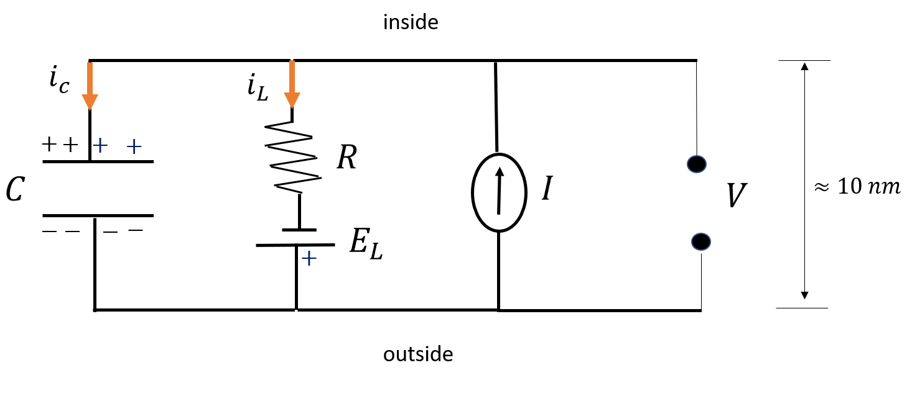

## the circuit model of a neuron (lecture 2)

### drift and diffusion

Electric signals in neurons are carried by ions
$K^+, Na^+,
Ca2^+$, and $Cl^-$. These ions move in and out of the cell through the membrane, while the signals travel along the axon to other cells. A neuron that is in equilibrium is practically a dead cell because no signal is coming in and out. Non-equilibrium processes make the cell fire and relay messages to and from $\sim$ 10000 other cells.

#### diffusion

Ions in the brain are not uniformly distributed in the neighborhood of membranes. Non-uniform distribution creates chemical gradients between the inside and outside of the cell, driving ions from high concentration to low concentration regions.

$$I_{diffusion} = -Aq D \frac{d c(x)}{dx}$$

where $A$ is the area of the membrane, $q$ is the ion's charge, and $c$ is the ionic concetration.

#### drift

There is a build-up of a net charge around the cell membrane. This build-up charge induces a local electric field along the membrane. The electric field induces a drift of charged ions in and out of the cell across open selective channels in the membrane. At equilibrium, this drift will cancel any diffusion.

$$I_{drift} = \frac{A q^2 c(x) D}{kT} \frac{\Delta V}{L}$$

#### Nernst potential

Solving $I_{drift} + I_{diffusion} = 0$, we obtain the equilibrium potential difference

$$\Delta V = \frac{k_B T}{q} \ln \left( \frac{c_{out}}{c_{in}} \right)$$

where $k_B = 1.38 \cdot 10^{-23} \ J/K$ is the Boltzmann constant.

By convention,

$$V_m = V_{in} - V_{out}$$

### The Sodium-Potassium circuit

Recall that the solution for the ODE
$$\tau \frac{dv}{dt} = - v + v_{\infty} \to v(t) = v_{\infty} + (v_0 - v_{\infty}) e^{-t / \tau}$$

In the following example, we model the neuron as a RC circuit. The capacitor has capacitance $C_m = 0.1 nF$; the leak resistor in parallel has resistance $R = 100 M\Omega$; the battery is $E_L = -75 mV$. The system is governed by the ODE
$$\tau \frac{dV}{dt} = - (V - E_L) + RI(t)$$

To numerically integrate this, we apply the Euler method:

$$dV_{t} = \frac{dt}{\tau} \left( -V_{t} + (E_L + RI_t) \right)$$
$$V_{t+1} = V_{t} + dV_{t} = V_t + \frac{dt}{\tau} \left( -V_{t} + (E_L + RI_t) \right)$$
