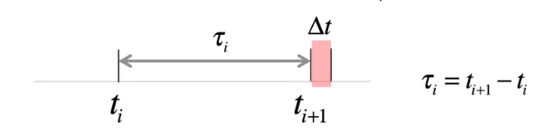
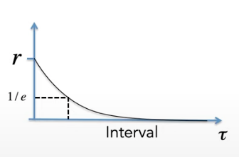

## spike trains and poisson model (lecture 13)

### neuronal spikings: poisson processes

#### neuronal responses are variable

Imagine a random process that produces spikes at an average rate of $\mu$ spikes per second during the stimulus presentation.

We can break up the spike train into small time bins of some duration $\Delta t$. Each spike is generated independently of other spikes and with equal probability in each bin.

If $\Delta t$ is small enough that most of the bins have zero spikes, we can write the probability that a spike occurs in any bin as $\mu \Delta t$.

Let $P_T[n]$ denote the probability that $n$ spikes land in the interval $T$. The probability of having $n$ bins with a spike is $$(\mu \Delta t)^n$$ The probability of having $M-n$ bins with no spike is $$(1 - \mu \Delta t)^{M-n}$$ The number of different ways to distinguish $n$ spikes in $M$ bins is $$\frac{M!}{(M - n)! n!}$$

Then the probability that $n$ spikes land in the interval $T$ is

$$P_T[n] = \lim_{\Delta t \to 0} \frac{M!}{(M - n)! n!}(\mu \Delta t)^n (1 - \mu \Delta t)^{M-n}$$

In the limit that $\Delta t \to 0$, $M = \frac{T}{\Delta t} \to \infty$, we have

$$P_T[n] = \frac{(\mu T)^n}{n!} e^{-\mu T}$$

be a Poisson distribution.

The Poisson distribution gives us the probability that $n$ spikes land in the interval $T$. **The average (expected) number of spikes** is

$$\langle n \rangle = \sum_{n=0}^{\infty} n P_T[n] = \mu T$$

Thus, $\mu = \frac{\langle n \rangle}{T}$ is also the average spike rate. Variance in the spike count is

$$\sigma_n^2(T) = \langle (n - \langle n \rangle)^2 \rangle = \langle n^2 \rangle - \langle n \rangle^2$$

$$\sigma_n^2(T) = \mu T$$

The Fano factor which is defined as

$$F = \frac{\sigma_n^2(T)}{\langle n \rangle} = 1$$

is one for the Poisson distribution.

The statistics of spiking in a neurons approximates the Poisson distribution. Let $n$ be the number of spikes within a time interval $T$ and let $\lambda$ be the expectation value of firings over many trials. A Poisson distribution is described as $$P(n) = \lambda^n e^{-\lambda}/n!$$ In a homogeneous Poisson process $X$, events recorded at different interval of times are independent from each other. In the limit of large number of events, the Poisson distribition approaches Gaussian.

For a Poisson process $X$, the variance is equal to the expectation value of firings over many trials.
$$\mathbb{E}[X] = \lambda = var[X]$$

By definition, the expectation value of $X$ is the sum of the products of the number of firing events and the probability of each event's occurence:
$$\mathbb{E}[X] = \sum_{n = 0, 1, 2, \dots} n \lambda^n e^{-\lambda}/n!$$

Note that we can write $$e^{\lambda} = \sum_{n=0, 1, 2, \dots} \lambda^n / n!$$
which if substituting to $\mathbb{E}[X]$ gives us
$$\mathbb{E}[X] = e^{-\lambda}\sum_{n = 0, 1, 2, \dots} n \lambda^n / n! = \frac{\sum_{n = 0, 1, 2, \dots} n \lambda^n / n!}{\sum_{n=0, 1, 2, \dots} \lambda^n / n!} = \lambda$$

(The details of how this is carried out is pretty involved; solving it analytically likely requires revisiting the topic on convergence in real analysis)

By normalization, we have $$\sum_{n=0,1,2,3,\dots} P(n) = 1$$

### random spiking and inter-spike interval (ISI)

#### the distribution of intervals between spikes

Let's derive the probability of having the next spike land in the interval between $t_{i+1}$ and $t_{i+1} + \Delta t$.

The probability of having 0 spike from time $t_i$ to $t_{i+1}$ is
$$P_t[n=0] = \frac{(r \tau)^0}{0!} e^{-rt} = e^{rt}$$

The probability of having 1 spike from $t_{i+1}$ to $t_{i+1} + \Delta t$ is
$$P_t[n=1] = r\Delta t$$

The total probability is
$$P[\tau] = e^{-rt} r\Delta t$$

The probability density (probability per unit time) is just

$$\frac{1}{\Delta t} P[\tau] = r e^{-rt}$$

### convolution

Convolution allows us to model the output of a system as a linear filter acting on its input. We use convolution to model the response of membrane potential to synaptic current, the response of neurons to a time-dependent stimulus, implementing a low-pass or high-pass filter.

$$y(t) = \int_{-\infty}^{\infty} d\tau G(\tau) x(t - \tau)$$