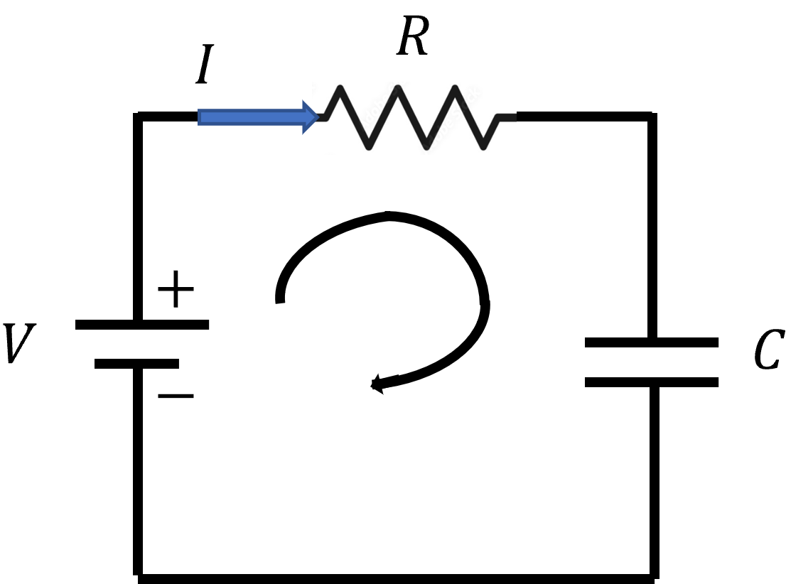

## random motion and diffusion (lecture 0, 1)

### standard DE form and its solution

$$\tau \frac{dx}{dt} = -x + v$$
Let $y = x - v$ . Then, $$\tau \frac{dy}{dt} = -y$$

$$\frac{dy}{dt} = -y(t) / \tau$$

$$\int \frac{-\tau}{y(t)} \ dy = \int dt$$

$$\tau \ln y(t) + c = \tau + c'$$

$$ \ln y(t) = -t/\tau + c''$$

$$y(t) = y_0 \ e^{-t/\tau}$$

Now, we substitute back $y = x - v$ to get our final answer

$$ x(t) - v = (x_0 - v) e^{-t / v} \to x(t) = (x_0 - v) e^{-t / v} + v$$

### RC circuits

By the Kirchoff's law, the sum of voltage acorss all elements in a circuit is zero. So,

$$V - R I(t) - v_c = 0$$

where $v_c$ is the instantaneous voltage across the capacitor.

Let $\tau = RC$. We take derivatives w.r.t time on both sides to get

$$\frac{d v_c}{dt} = - \frac{1}{\tau} v_c + \frac{1}{\tau} V$$

Using the general solution we have found for DE in this form

$$\tau \frac{d v_c}{dt} = - v_c + V$$

we get

$$v_c(t) = (v_c(0) - V) \ e^{-t/\tau} + V$$

Now, we apply the relation $Q = CV$

$$Q  = C v_c$$

Taking derivative on both sides:

$$\frac{d Q}{dt} = I(t) = C \frac{d v_c}{dt}$$

### the Binomial distribution

Suppose the probability of getting a coin head after flipping it is $p$ and getting a tail is $1 - p$. Then, if we flip a biased coin $n$ times, the probability of getting **one sequence** of $k$ heads is

$$p(k \ \text{heads}) = p^k (1 - p)^{n - k}$$

The probability of getting exactly $k$ heads (with multiple sequences) irrespective of order is

$$P(k) = \begin{pmatrix} n \\ k \end{pmatrix} p^k (1-p)^{n-k}$$

Using the **binomial theorem**, we have

$$\sum_{k=0}^n P(k) = \sum_k \begin{pmatrix} n \\ k \end{pmatrix} p^k (1-p)^{n-k} = (p+ 1-p)^n = 1 $$

The average is

$$ \mu = ⟨ k ⟩  = np$$

and the variance  is

$$\sigma^2 = \langle (k-\mu)^2 \rangle  = \langle k^2 \rangle - \mu^2 = npq$$

### one-dimensional random motion

Let there be a large number of particles. Suppose that at collision, particles step either to the left or to the right with 50% chance for each. Define $\tau$ to be the time between collisions and $n$ be the number of collisions. Based on our assumptions, the following relationship holds true for a particle $i$'s location $x$:

$$x_i (n) = x_i(n - 1) \pm \delta, \quad\quad \delta = \tau v_x$$

$$\langle x_i^2 (n) \rangle = \langle x^2 (n-1) \rangle + \delta^2$$

Now observe the patterns, we found
$$x(0) = 0 \quad x(1) = \delta^2 \quad x(2) = 2\delta^2 \quad x(3) = 3\delta^2 \quad \dots$$

So, $$ \langle x^2(t) \rangle = \delta^2 n =\frac{\delta^2 t}{\tau}$$

#### diffusion constant $D$

We instroduce a diffusion constant defined as $$D = \frac{\delta^2}{2 \tau}$$

The typical length/distance of diffusion is

$$ L = \sqrt{\langle x^2(t) \rangle} = \sqrt{2Dt} $$

The typical time for diffusing a length $x$ is thus

$$t = \frac{x^2}{2D}$$

#### conclusion
Diffusion as a means of communication between cells is only effective at $\mu m$-scale, which is the scale of cell dimensions. It's super uneffective on the scale of $cm$ and beyond.

### 3-D diffusion

The typical length of diffusion in a 3-D space is

$$L = \sqrt{6 D t}$$